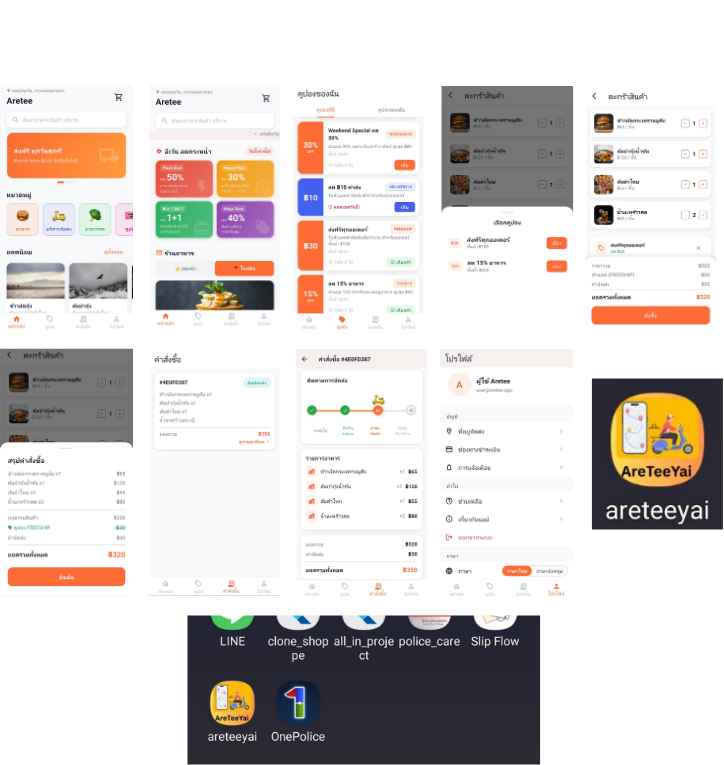

# Application : AreteeYai

  

  <b>AreteeYai</b> 
  แอปพลิเคชันสำหรับสั่งอาหาร สั่งของสด  
  รวมถึงบริการจ้างรถรับส่งภายในแอปเดียว

--------

# Preview Application

  

--------

# About Application

AreteeYai เป็นแอปพลิเคชันที่พัฒนาด้วย Flutter  
เพื่ออำนวยความสะดวกให้ผู้ใช้งานสามารถสั่งอาหาร  
สั่งของสด หรือเรียกใช้บริการรับส่งได้อย่างรวดเร็วผ่านมือถือ

ภายในแอปมีระบบแนะนำร้านค้าและเมนูอาหารตามตำแหน่งปัจจุบันของผู้ใช้งาน  
ช่วยให้สามารถค้นหาร้านค้าใกล้ตัวได้สะดวกมากยิ่งขึ้น

นอกจากนี้ยังรองรับระบบคูปองส่วนลด  
เพื่อช่วยให้ผู้ใช้งานสามารถนำคูปองมาใช้ลดราคาในการสั่งซื้อสินค้าและบริการได้

--------

# Features

- สั่งอาหารจากร้านค้าต่าง ๆ ผ่านแอปพลิเคชัน
- สั่งของสดและสินค้าทั่วไปได้สะดวกภายในแอปเดียว
- รองรับบริการจ้างรถรับส่ง
- ตรวจจับตำแหน่งปัจจุบันของผู้ใช้งาน  
- เก็บและใช้งานคูปองส่วนลดภายในแอปพลิเคชัน
- รองรับการเปลี่ยนภาษาในการใช้งาน
- ระบบตะกร้าสินค้าและสรุปรายการสั่งซื้อ
- ติดตามสถานะคำสั่งซื้อได้แบบ Real-time
- ออกแบบ UI ให้ใช้งานง่าย 

--------

# Technology Stack

- Flutter
- Dart
- Google Maps / Location Services
- REST API
- Material Design

--------
